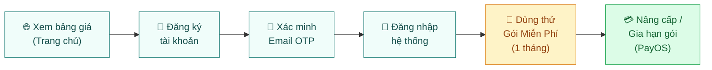
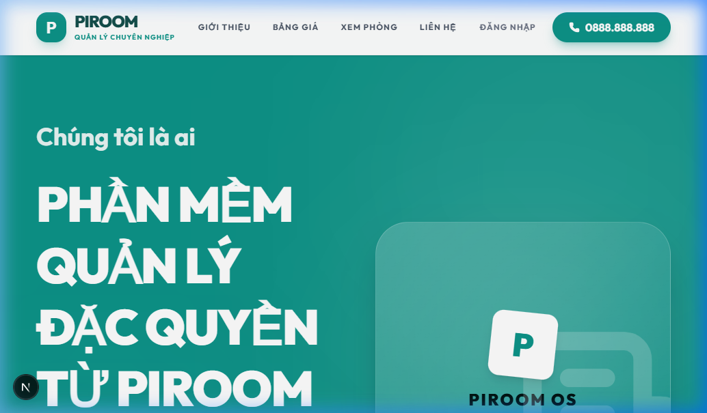
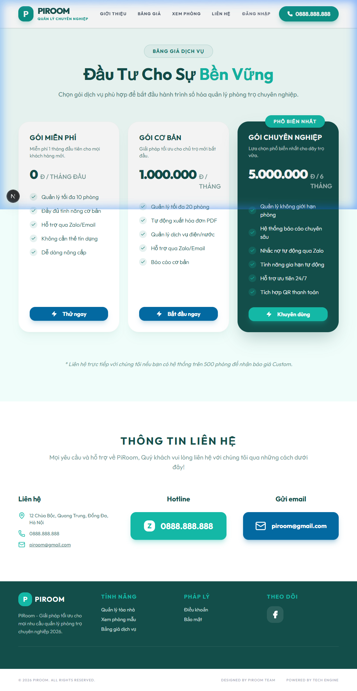
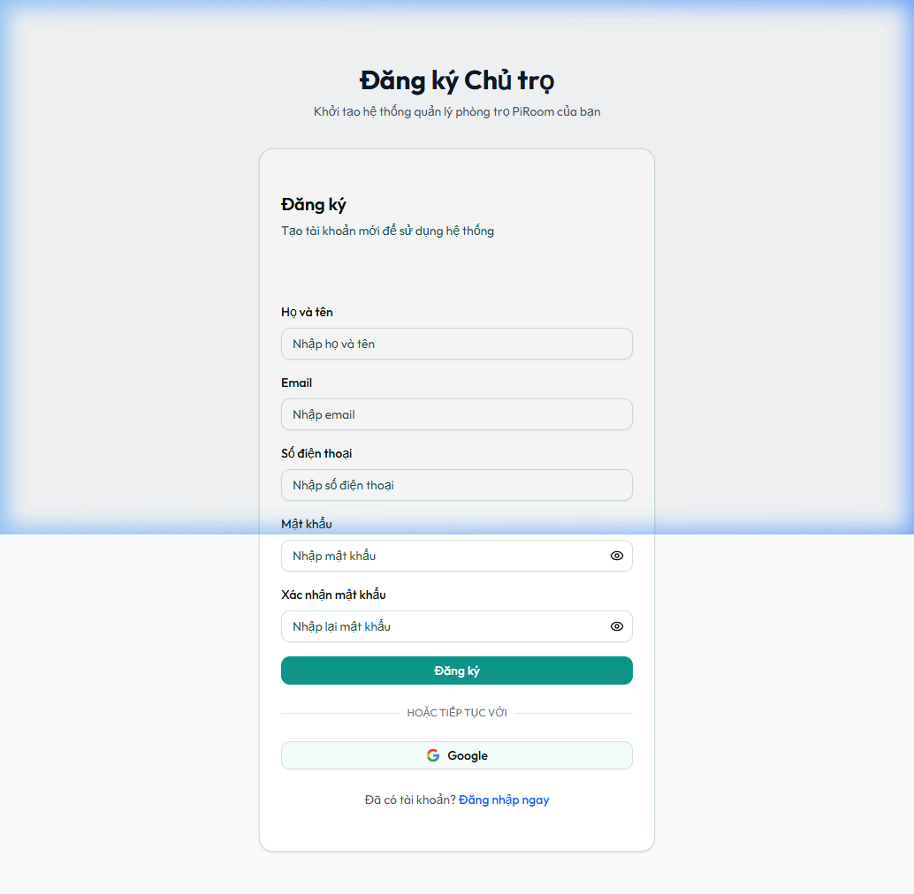
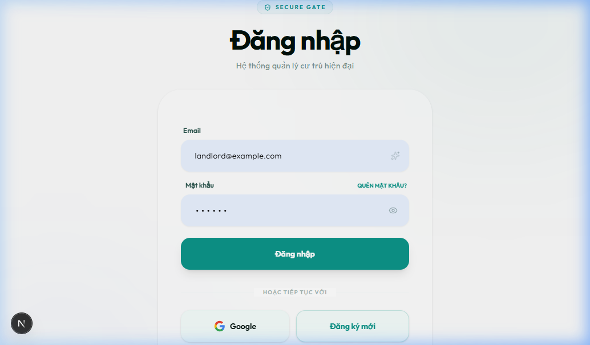
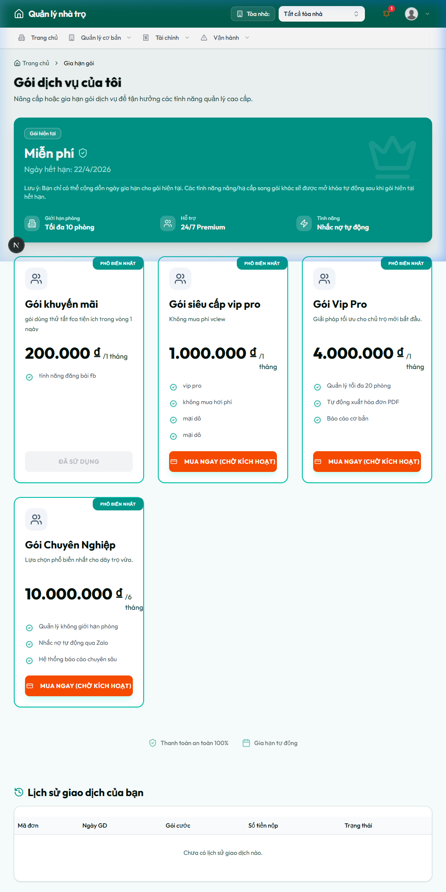
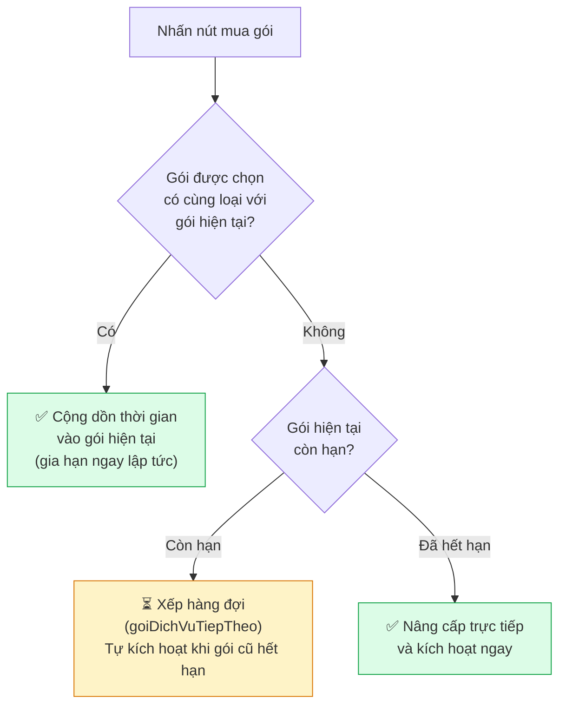

# 📘 Hướng Dẫn Sử Dụng: Quy Trình Đăng Ký & Sử Dụng Gói Dịch Vụ SaaS PiRoom

> **Phiên bản:** 1.0  
> **Cập nhật lần cuối:** 12/04/2026  
> **Áp dụng cho:** Chủ trọ / Khách hàng mới

---

## 📑 Mục Lục

1. [Tổng Quan Quy Trình](#1-tổng-quan-quy-trình)
2. [Bước 1: Xem Bảng Giá Dịch Vụ](#2-bước-1-xem-bảng-giá-dịch-vụ)
3. [Bước 2: Đăng Ký Tài Khoản Chủ Trọ](#3-bước-2-đăng-ký-tài-khoản-chủ-trọ)
4. [Bước 3: Xác Minh Email (OTP)](#4-bước-3-xác-minh-email-otp)
5. [Bước 4: Đăng Nhập Hệ Thống](#5-bước-4-đăng-nhập-hệ-thống)
6. [Bước 5: Sử Dụng Gói Miễn Phí (Dùng Thử)](#6-bước-5-sử-dụng-gói-miễn-phí-dùng-thử)
7. [Bước 6: Nâng Cấp / Gia Hạn Gói Dịch Vụ](#7-bước-6-nâng-cấp--gia-hạn-gói-dịch-vụ)
8. [Bước 7: Thanh Toán Qua Cổng PayOS](#8-bước-7-thanh-toán-qua-cổng-payos)
9. [Bước 8: Xác Nhận Kích Hoạt & Theo Dõi Giao Dịch](#9-bước-8-xác-nhận-kích-hoạt--theo-dõi-giao-dịch)
10. [Các Gói Dịch Vụ Chi Tiết](#10-các-gói-dịch-vụ-chi-tiết)
11. [Câu Hỏi Thường Gặp (FAQ)](#11-câu-hỏi-thường-gặp-faq)
12. [Liên Hệ Hỗ Trợ](#12-liên-hệ-hỗ-trợ)

---

## 1. Tổng Quan Quy Trình

Quy trình đăng ký sử dụng gói SaaS của PiRoom được thiết kế đơn giản, gồm **5 bước chính**:



> **Lưu ý quan trọng:**  
> - Mọi tài khoản Chủ trọ mới đăng ký sẽ được **tự động kích hoạt Gói Miễn Phí** với thời hạn **1 tháng dùng thử**.  
> - Gói Miễn Phí chỉ được sử dụng **1 lần duy nhất** khi tạo tài khoản, không thể đăng ký lại.  
> - Sau khi hết hạn dùng thử, bạn cần nâng cấp lên Gói Cơ Bản hoặc Gói Chuyên Nghiệp để tiếp tục sử dụng.

---

## 2. Bước 1: Xem Bảng Giá Dịch Vụ

### 2.1. Truy cập trang chủ PiRoom

Mở trình duyệt web (Chrome, Firefox, Edge...) và truy cập địa chỉ trang chủ PiRoom.



### 2.2. Xem bảng giá

Từ thanh điều hướng (Navbar) phía trên, nhấn vào mục **"BẢNG GIÁ"** hoặc truy cập trực tiếp trang `/bang-gia`.



### 2.3. Chọn gói phù hợp

Hệ thống cung cấp **3 gói dịch vụ**:

| Tiêu chí | 🆓 Gói Miễn Phí | 📦 Gói Cơ Bản | 🚀 Gói Chuyên Nghiệp |
|---|---|---|---|
| **Giá** | 0 đ | 1.000.000 đ | 5.000.000 đ |
| **Thời hạn** | 1 tháng (dùng thử) | 1 tháng | 6 tháng |
| **Số phòng tối đa** | 10 phòng | 20 phòng | Không giới hạn |
| **Tính năng nổi bật** | Đầy đủ tính năng cơ bản | Xuất hóa đơn PDF, Báo cáo cơ bản | Nhắc nợ tự động qua Zalo, Báo cáo chuyên sâu, QR thanh toán |
| **Hỗ trợ** | Zalo/Email | Zalo/Email | Ưu tiên 24/7 |

Nhấn nút **"Thử ngay"**, **"Bắt đầu ngay"** hoặc **"Khuyên dùng"** trên thẻ gói mong muốn → Hệ thống sẽ chuyển bạn sang trang **Đăng ký tài khoản**.

---

## 3. Bước 2: Đăng Ký Tài Khoản Chủ Trọ

### 3.1. Truy cập trang đăng ký

Trang đăng ký có đường dẫn: `/dang-ky`



### 3.2. Điền thông tin đăng ký

Điền đầy đủ các trường thông tin sau:

| Trường | Yêu cầu | Ví dụ |
|---|---|---|
| **Họ và tên** | Tối thiểu 2 ký tự | `Nguyễn Văn A` |
| **Email** | Email hợp lệ, chưa được sử dụng | `nguyenvana@gmail.com` |
| **Số điện thoại** | 10-11 chữ số | `0901234567` |
| **Mật khẩu** | Tối thiểu 6 ký tự | `MatKhau123` |
| **Xác nhận mật khẩu** | Phải trùng khớp với mật khẩu | `MatKhau123` |

> ⚠️ **Lưu ý:**  
> - Vai trò mặc định khi đăng ký là **Chủ nhà (chuNha)**.  
> - Email và số điện thoại phải là **duy nhất** trên hệ thống (chưa ai sử dụng trước đó).  
> - Mật khẩu nên kết hợp chữ hoa, chữ thường và số để đảm bảo an toàn.

### 3.3. Nhấn "Đăng ký"

Sau khi điền xong, nhấn nút **"Đăng ký"**. Nếu thông tin hợp lệ, hệ thống sẽ:
1. Tạo tài khoản với trạng thái **chưa xác minh email**.
2. Gửi mã OTP 6 chữ số đến email bạn đã đăng ký.
3. Chuyển sang bước **Xác minh Email**.

### 3.4. Đăng ký bằng Google (Tùy chọn)

Bạn có thể nhấn nút **"Google"** ở cuối form để đăng ký nhanh bằng tài khoản Google mà không cần nhập thông tin thủ công.

---

## 4. Bước 3: Xác Minh Email (OTP)

Sau khi đăng ký thành công, giao diện sẽ tự động chuyển sang màn hình **"Xác thực Email"**.

### 4.1. Kiểm tra hộp thư email

- Mở hộp thư email bạn đã đăng ký.
- Tìm email từ **PiRoom** với tiêu đề xác minh tài khoản.
- Trong email sẽ có **mã OTP gồm 6 chữ số** (ví dụ: `482759`).

### 4.2. Nhập mã OTP

- Quay lại trang đăng ký.
- Nhập đúng 6 chữ số OTP vào ô nhập liệu.
- Nhấn nút **"Xác nhận"**.

### 4.3. Xử lý khi không nhận được mã

| Tình huống | Giải pháp |
|---|---|
| Chưa nhận được email sau 1 phút | Kiểm tra mục **Spam / Junk Mail** |
| Cần gửi lại mã | Nhấn liên kết **"Gửi lại mã"** (có thể nhấn lại sau 60 giây) |
| Muốn sửa email | Nhấn **"Quay lại đăng ký"** để điền lại thông tin |

> ⏰ **Thời hạn:** Mã OTP có hiệu lực trong vòng **10 phút** kể từ khi gửi. Sau 10 phút mã sẽ hết hạn và bạn cần gửi lại mã mới.

### 4.4. Xác minh thành công

Sau khi xác minh OTP thành công:
- Hệ thống hiển thị thông báo **"Xác minh thành công! Đang chuyển hướng..."**
- Tự động chuyển hướng sang trang **Đăng nhập** sau 2 giây.

---

## 5. Bước 4: Đăng Nhập Hệ Thống

### 5.1. Truy cập trang đăng nhập

Trang đăng nhập có đường dẫn: `/dang-nhap`



### 5.2. Nhập thông tin đăng nhập

| Trường | Giá trị |
|---|---|
| **Email** | Email đã đăng ký và xác minh |
| **Mật khẩu** | Mật khẩu đã tạo khi đăng ký |

### 5.3. Nhấn "Đăng nhập"

Sau khi đăng nhập thành công:
- Vai trò **Chủ nhà**: Chuyển hướng vào trang **Dashboard** quản lý (`/dashboard`).
- Vai trò **Khách thuê**: Chuyển hướng vào trang Dashboard dành cho khách thuê.

### 5.4. Các tùy chọn khác

- **Đăng nhập bằng Google:** Nhấn nút "Google" để đăng nhập nhanh.
- **Quên mật khẩu:** Nhấn liên kết "QUÊN MẬT KHẨU?" để khởi tạo quy trình đặt lại mật khẩu qua email.
- **Chưa có tài khoản:** Nhấn nút "Đăng ký mới" để quay lại trang đăng ký.

---

## 6. Bước 5: Sử Dụng Gói Miễn Phí (Dùng Thử)

### 6.1. Tự động kích hoạt

Ngay khi đăng nhập lần đầu, tài khoản Chủ trọ sẽ được tự động gán:
- **Gói dịch vụ:** Miễn Phí (`mienPhi`)
- **Thời hạn:** 1 tháng kể từ ngày đăng ký
- **Giới hạn:** Quản lý tối đa **10 phòng**

### 6.2. Tính năng có sẵn trong gói Miễn Phí

Với gói dùng thử, bạn đã có thể sử dụng đầy đủ các tính năng cơ bản:

- ✅ Quản lý tòa nhà và phòng trọ (tối đa 10 phòng)
- ✅ Quản lý khách thuê, hợp đồng
- ✅ Ghi chỉ số điện nước hàng tháng
- ✅ Tạo và xuất hóa đơn
- ✅ Ghi nhận thanh toán
- ✅ Quản lý sự cố, thông báo
- ✅ Dashboard thống kê tổng quan

### 6.3. Kiểm tra thông tin gói hiện tại

Truy cập **Dịch vụ SaaS** → **Gia hạn gói** từ thanh điều hướng bên trái (sidebar) hoặc truy cập trực tiếp: `/dashboard/gia-han-goi`

Tại đây bạn sẽ thấy:
- **Gói hiện tại** và ngày hết hạn
- Giới hạn phòng của gói
- Các gói khả dụng để nâng cấp

---

## 7. Bước 6: Nâng Cấp / Gia Hạn Gói Dịch Vụ

Khi gói dùng thử sắp hết hạn hoặc bạn cần thêm tính năng/phòng, hãy nâng cấp gói.

### 7.1. Truy cập trang Gia hạn gói

Đường dẫn: `/dashboard/gia-han-goi`



### 7.2. Chọn gói muốn mua

Trang hiển thị danh sách các gói đang hoạt động với thông tin:
- Tên gói, mô tả
- Giá và thời hạn sử dụng
- Danh sách tính năng đi kèm

Mỗi gói sẽ hiển thị một trong các nút sau:

| Nút | Ý nghĩa |
|---|---|
| **"Gia hạn ngay"** | Gói đang sử dụng → Mua thêm để cộng dồn thời gian |
| **"Mua ngay (Chờ kích hoạt)"** | Gói khác với gói hiện tại → Sẽ tự động kích hoạt sau khi gói hiện tại hết hạn |
| **"Đã sử dụng"** (xám) | Gói Miễn Phí → Không thể mua lại |
| **"Đã xếp hàng đợi"** (vàng) | Bạn đã mua gói này và đang chờ kích hoạt |

### 7.3. Logic gia hạn / nâng cấp



> **Ví dụ thực tế:**
> - Đang dùng **Gói Cơ Bản** (còn hạn đến 15/05) → Mua thêm **Gói Cơ Bản** → Hạn mới = 15/06 (cộng thêm 1 tháng).
> - Đang dùng **Gói Cơ Bản** (còn hạn đến 15/05) → Mua **Gói Chuyên Nghiệp** → Gói Chuyên Nghiệp sẽ tự kích hoạt từ 15/05.
> - Đang dùng **Gói Miễn Phí** (đã hết hạn) → Mua **Gói Cơ Bản** → Kích hoạt ngay lập tức.

---

## 8. Bước 7: Thanh Toán Qua Cổng PayOS

### 8.1. Chuyển hướng đến trang thanh toán

Sau khi nhấn nút mua gói, hệ thống sẽ:
1. Tạo hóa đơn SaaS với trạng thái **"Chờ duyệt"**
2. Gửi yêu cầu đến cổng thanh toán **PayOS**
3. Tự động chuyển hướng trình duyệt của bạn đến trang thanh toán bảo mật của PayOS

### 8.2. Thực hiện thanh toán

Tại trang PayOS, bạn có thể thanh toán bằng một trong các phương thức:
- **Quét mã QR** bằng ứng dụng ngân hàng trên điện thoại
- **Chuyển khoản thủ công** theo thông tin hiển thị trên màn hình

### 8.3. Sau khi thanh toán

| Kết quả | Hành động của hệ thống |
|---|---|
| **Thanh toán thành công** | Trả về trang Gia hạn gói với thông báo ✅ thành công, tự động cộng ngày |
| **Thanh toán bị hủy** | Trả về trang Gia hạn gói với thông báo ❌ hủy bỏ |
| **Thanh toán 1 phần** | Ghi nhận số tiền đã chuyển, trạng thái "Chưa thanh toán hết" |

### 8.4. Cơ chế xác nhận kép (Double Verification)

Hệ thống sử dụng **2 cơ chế song song** để đảm bảo không bỏ sót giao dịch:

1. **Webhook tự động (Realtime):** PayOS gửi thông báo ngược về server PiRoom ngay khi tiền vào tài khoản → Hệ thống tự động gia hạn + gửi thông báo.
2. **API Polling (Dự phòng):** Khi người dùng quay lại trang, hệ thống tự gọi API kiểm tra lại trạng thái giao dịch → Xử lý bù nếu Webhook chưa kịp.

---

## 9. Bước 8: Xác Nhận Kích Hoạt & Theo Dõi Giao Dịch

### 9.1. Kiểm tra trạng thái gói sau thanh toán

Sau khi thanh toán thành công, quay lại trang `/dashboard/gia-han-goi` để xác nhận:
- **Gói hiện tại** đã được cập nhật
- **Ngày hết hạn** đã được cộng thêm đúng thời gian của gói mua
- Nếu mua gói khác loại → Hiển thị badge **"Gói tiếp theo đang đợi: ..."**

### 9.2. Thông báo xác nhận

Hệ thống tự động gửi **thông báo nội bộ** đến tài khoản của bạn sau khi thanh toán thành công, bao gồm:
- Tên gói đã mua
- Mã đơn hàng (orderCode)
- Ngày hết hạn mới
- Lời cảm ơn từ PiRoom

### 9.3. Lịch sử giao dịch

Phía dưới trang Gia hạn gói có bảng **"Lịch sử giao dịch của bạn"** hiển thị toàn bộ lịch sử thanh toán SaaS:

| Cột | Mô tả |
|---|---|
| **Mã đơn** | Mã đơn hàng PayOS dạng số |
| **Ngày GD** | Ngày và giờ thực hiện giao dịch |
| **Gói cước** | Tên gói dịch vụ đã mua |
| **Số tiền nộp** | Số tiền thực tế đã chuyển |
| **Trạng thái** | Thành công / Chưa thanh toán đủ / Đã hủy / Đang chờ duyệt |

---

## 10. Các Gói Dịch Vụ Chi Tiết

### 🆓 Gói Miễn Phí

```
Giá:          0 đ
Thời hạn:     1 tháng (chỉ 1 lần duy nhất)
Số phòng:     Tối đa 10 phòng
Tính năng:    Đầy đủ tính năng cơ bản
Hỗ trợ:      Zalo / Email
Lưu ý:       Không thể đăng ký lại sau khi hết hạn
```

### 📦 Gói Cơ Bản

```
Giá:          1.000.000 đ / tháng
Thời hạn:     1 tháng (có thể gia hạn cộng dồn)
Số phòng:     Tối đa 20 phòng
Tính năng:    Xuất hóa đơn PDF, Quản lý điện/nước, Báo cáo cơ bản
Hỗ trợ:      Zalo / Email
Phù hợp:     Chủ trọ quy mô nhỏ (5-20 phòng)
```

### 🚀 Gói Chuyên Nghiệp

```
Giá:          5.000.000 đ / 6 tháng
Thời hạn:     6 tháng (có thể gia hạn cộng dồn)
Số phòng:     Không giới hạn
Tính năng:    Nhắc nợ tự động qua Zalo, Báo cáo chuyên sâu,
              Tích hợp QR thanh toán, Tính năng gia hạn tự động
Hỗ trợ:      Ưu tiên 24/7
Phù hợp:     Chủ trọ quy mô lớn hoặc quản lý nhiều tòa nhà
```

---

## 11. Câu Hỏi Thường Gặp (FAQ)

### ❓ Tôi có thể dùng thử miễn phí bao lâu?

Gói Miễn Phí cho phép dùng thử **1 tháng** kể từ ngày đăng ký. Sau khi hết hạn, bạn cần mua gói Cơ Bản hoặc Chuyên Nghiệp.

### ❓ Gói Miễn Phí hết hạn thì dữ liệu có bị mất không?

**Không.** Toàn bộ dữ liệu (tòa nhà, phòng, khách thuê, hợp đồng, hóa đơn...) vẫn được **lưu trữ an toàn** trên hệ thống. Bạn chỉ cần nâng cấp gói để tiếp tục truy cập và sử dụng.

### ❓ Tôi có thể nâng cấp gói giữa chừng không?

**Có.** Bạn có thể mua gói khác bất cứ lúc nào:
- Nếu gói hiện tại chưa hết hạn → Gói mới sẽ **"xếp hàng đợi"** và tự kích hoạt khi gói cũ hết hạn.
- Nếu gói hiện tại đã hết hạn → Gói mới sẽ **kích hoạt ngay lập tức**.

### ❓ Tôi đã thanh toán nhưng chưa thấy cập nhật?

Hãy thử các bước sau:
1. **Chờ 1-2 phút** để Webhook đồng bộ.
2. **F5 (Refresh)** lại trang Gia hạn gói.
3. **Đăng xuất và đăng nhập lại** để cập nhật session.
4. Nếu vẫn chưa được, **liên hệ hỗ trợ** kèm ảnh chụp biên lai chuyển khoản.

### ❓ Nhân viên của tôi có cần mua gói riêng không?

**Không.** Nhân viên do Chủ trọ tạo sẽ **kế thừa thời hạn** của gói Chủ trọ. Khi Chủ trọ gia hạn, tất cả nhân viên sẽ tự động được cập nhật ngày hết hạn mới.

### ❓ Thanh toán qua những phương thức nào?

Hiện tại hệ thống hỗ trợ thanh toán qua **cổng PayOS**, bao gồm:
- Quét mã VietQR bằng app ngân hàng
- Chuyển khoản trực tiếp

### ❓ Tôi muốn hoàn tiền được không?

Vui lòng liên hệ trực tiếp đội ngũ hỗ trợ PiRoom qua Zalo hoặc Email để được tư vấn chính sách hoàn tiền cho từng trường hợp cụ thể.

---

## 12. Liên Hệ Hỗ Trợ

Nếu bạn gặp khó khăn trong quá trình đăng ký hoặc thanh toán, hãy liên hệ:

| Kênh | Thông tin |
|---|---|
| 📍 **Địa chỉ** | 12 Chùa Bộc, Quang Trung, Đống Đa, Hà Nội |
| 📞 **Hotline (Zalo)** | 0392.537.324 |
| ✉️ **Email** | 25A4042227@hvnh.edu.vn |

---

> 📌 *Tài liệu này được tạo tự động dựa trên mã nguồn và giao diện thực tế của hệ thống PiRoom phiên bản hiện tại.*
